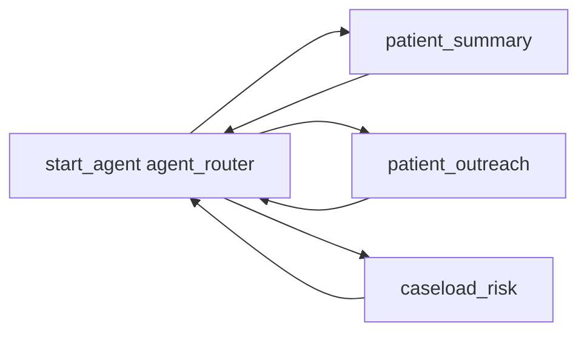

# CCG Copilot — Agent Script (for the new Agent Builder)

Two ways to get this agent into your scratch org. Pick one.

## Option A — Paste into the new Agent Builder UI (fastest)

1. Setup → Quick Find → **Agents** → **New Agent**
2. Choose the **new Agent Builder** (the one with the code editor / "Agent Script" tab)
3. When prompted for the script source, paste the entire contents of
   [force-app/main/default/aiAuthoringBundles/CCG_Copilot/CCG_Copilot.agent](force-app/main/default/aiAuthoringBundles/CCG_Copilot/CCG_Copilot.agent)
4. Save → **Activate**
5. Copy the **18-character agent ID** (starts with `0Xx`) from the URL → send to me

## Option B — Deploy via CLI (cleaner, fully declarative)

The authoring bundle is committed in the repo. To deploy:

```bash
cd ccg-demo

# Validate compilation (already passing — confirmed 5/22)
sf agent validate authoring-bundle --json --api-name CCG_Copilot --target-org ccg-scratch

# Deploy the bundle
sf project deploy start --source-dir force-app/main/default/aiAuthoringBundles/CCG_Copilot --target-org ccg-scratch

# Publish (creates a permanent version)
sf agent publish authoring-bundle --json --api-name CCG_Copilot --target-org ccg-scratch

# Activate so the chat widget can talk to it
sf agent activate --json --api-name CCG_Copilot --target-org ccg-scratch
```

Then send me the 18-character agent ID and I'll swap it into the React widget.

---

## What the agent does

CCG Copilot is an **employee agent** (runs as the logged-in clinician, no messaging channel needed). It uses the **hub-and-spoke** pattern:



| Subagent | Triggered by | What it does |
| --- | --- | --- |
| `patient_summary` | *"Summarize Sarah Mitchell's last 3 sessions"* | 4-section structured recap: recent sessions, clinical signals, engagement, suggested next step |
| `patient_outreach` | *"Draft a check-in message for Sarah"* | Clinician-voice message under 90 words, with a specific next step |
| `caseload_risk` | *"Who on my caseload is at risk this week?"* | Top 3–5 ranked list with risk level + biggest signal per patient |

Each subagent always returns to the `agent_router` when the clinician moves on.

---

## Demo prompts to click during the call

These three prompts collectively prove all five things Marjorie cares about. Click-don't-type them into the floating chat widget on Sarah's Patient 360:

1. **"Summarize Sarah Mitchell's last 3 sessions"** — Patient 360 / clinical continuity
2. **"Draft a check-in message for Sarah"** — replaces Mailchimp + admin time
3. **"Who on my caseload is at risk of churn this week?"** — proactive AI / consolidation

---

## Prereqs before the chat widget will render

1. **First-party cookies** — Setup → My Domain → uncheck *"Require first party use of Salesforce cookies"* → Save
2. **Agent activated** — Setup → Agents → CCG Copilot → Activate (or run `sf agent activate` from Option B)
3. **Real agent ID swapped into the React app** — once you send it to me, I update [src/components/CcgCopilot.tsx](force-app/main/default/uiBundles/CCG/src/components/CcgCopilot.tsx) and redeploy in ~60 seconds

---

## Notes for future iteration

- No backing logic actions yet — the agent answers from its instructions alone. When you want it to actually pull patient data from Salesforce (rather than the clinician describing context in the prompt), we add `actions:` with `target: "apex://..."` or `target: "flow://..."` to each subagent.
- Variables are minimal (`current_patient` is set up but not yet used) — leaves room to grow.
- All three subagents transition back to the router cleanly, so the clinician can switch tasks mid-conversation without restarting the chat.
